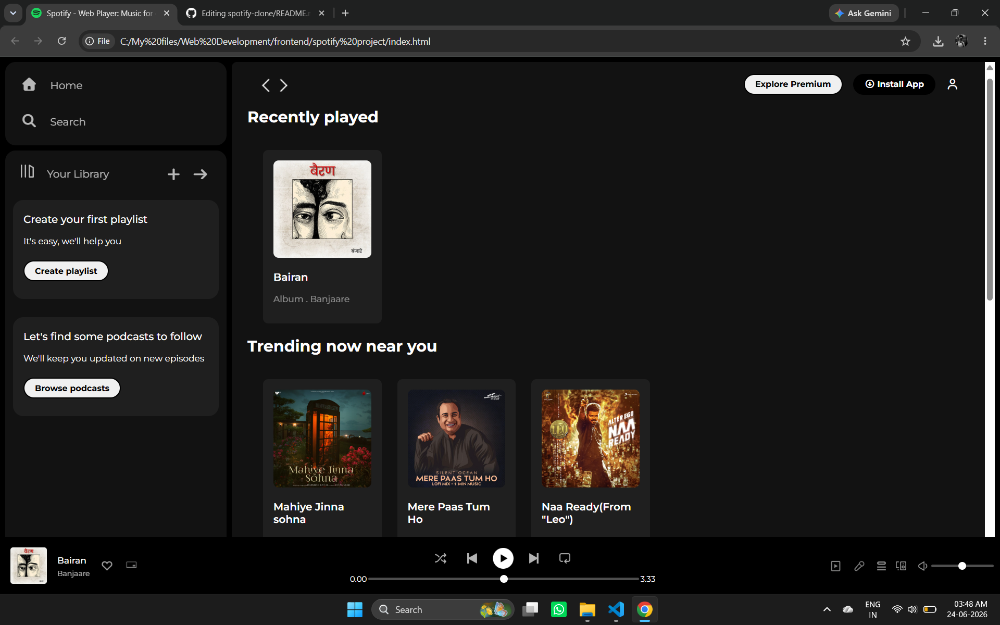

# 🎵 Spotify Clone

A responsive Spotify Web Player Clone built using HTML and CSS.

This project was created to practice frontend development concepts such as Flexbox, responsive layouts, sticky positioning, and UI design by recreating Spotify's web player interface.

## ✨ Features

* 🎵 Spotify-inspired UI
* 📚 Library Section
* 📻 Popular Radio
* 🎧 Music Player Interface
* 📌 Sticky Navigation Bar
* 📱 Responsive Layout

## 🛠️ Technologies Used

* HTML5
* CSS3
* Font Awesome
* Google Fonts (Montserrat)

## 📚 What I Learned

* Flexbox Layout
* Responsive Design
* Fixed & Sticky Positioning
* CSS Hover Effects
* UI Cloning and Layout Design

## 📸 Preview

## 🚀 Future Improvements

* Add JavaScript functionality
* Improve responsiveness
* Add music playback features

## 👨‍💻 Author

**Abhay Chouhan**

CSE Student at GHRCE, Nagpur | Frontend Developer
